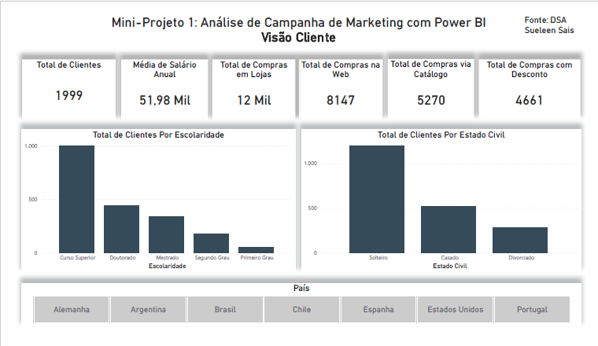
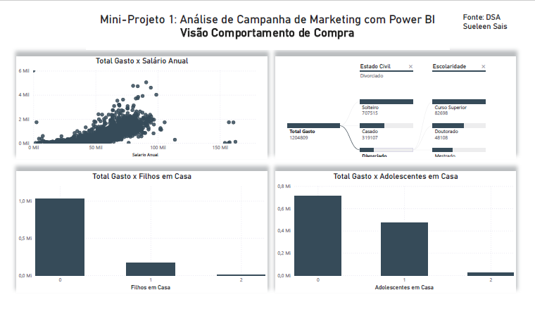
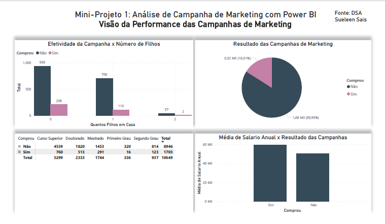

📊 Mini-Projeto 1: Análise de Campanhas de Marketing com Power BI

🎯 Objetivo
Este Mini-Projeto apresenta uma introdução prática à análise de campanhas de Marketing utilizando o Power BI, desenvolvido como parte do curso **"Microsoft Power BI Para Business Intelligence e Data Science"** da plataforma **DSA (Data Science Academy)**.  

Os dados utilizados foram disponibilizados pela DSA e representam informações fictícias sobre clientes e campanhas de Marketing realizadas por uma empresa.  

O projeto simula um cenário de negócio real, permitindo a prática de análises, correção de dados, cálculo de métricas e extração de insights para apoiar decisões estratégicas na área de Marketing.

📂 Descrição do Projeto
Durante o desenvolvimento foram criados 4 dashboards, com 10 elementos visuais, aplicando:
- Customizações e formatações  
- Correções nos dados  
- Diferentes recursos do Power BI estudados no capítulo  

As análises foram divididas em quatro visões principais:
- **Visão do Cliente**  
- **Visão do Comportamento de Compra do Cliente**  
- **Visão da Performance das Campanhas de Marketing**  
- **Visão dos Padrões de Compra no Ponto de Venda (País)**  

Cada visão busca compreender variáveis relevantes, criar gráficos e medidas, extrair métricas e cruzar dados, com o objetivo de entregar aos tomadores de decisão uma visão completa sobre:
- O perfil dos clientes  
- Os padrões de compra  
- A efetividade das campanhas de Marketing  

🔎 Estrutura das Análises
1. Visão do Cliente  
2. Visão do Comportamento de Compra do Cliente  
3. Visão da Performance das Campanhas de Marketing  
4. Visão dos Padrões de Compra no Ponto de Venda (País)  

🛠 Recursos Utilizados
- Power BI Desktop  
- Power Query para transformação e limpeza dos dados  
- Modelagem de dados com relacionamentos entre tabelas  
- Medidas DAX para cálculos personalizados  
- Dashboards interativos com gráficos e KPIs  

🚀 Aprendizados
- Modelagem de dados no Power BI  
- Criação de medidas DAX (ex.: ticket médio, % de compras com desconto)  
- Storytelling com dados  
- Simulação de cenários reais de negócio  

📊 Exemplos de Visualizações

📌 Como visualizar
1. Baixe o arquivo `.pbix` disponível neste repositório  
2. Abra no **Power BI Desktop** para explorar os relatórios  
3. Utilize os filtros e interações para navegar pelas diferentes visões

